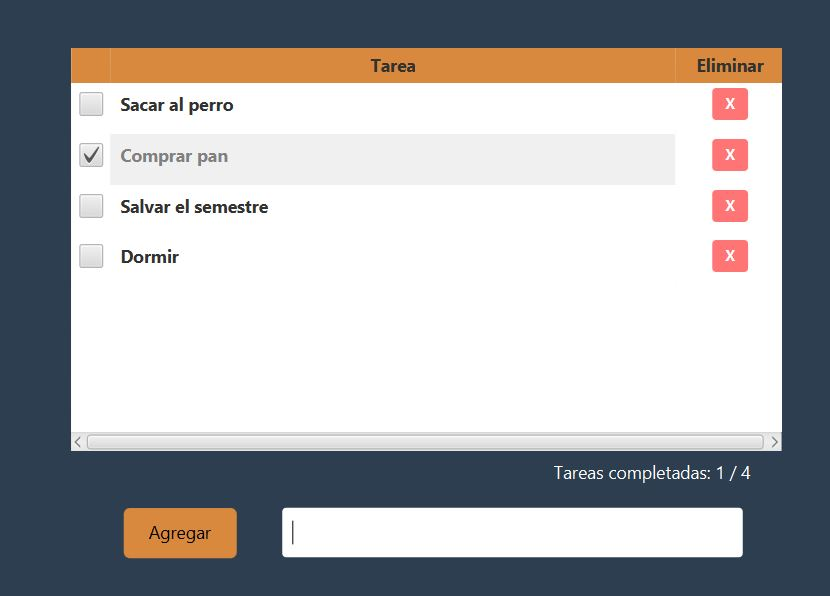

# 🎯 Gestor de tareas simple
<div align="center" >
  
</div>

## 📚 Descripción
Un simple gestor de tareas creado con la intención de practicar JavaFX y CSS para el diseño de aplicaciones de escritorio.

## 📊 Características Principales
- Agregar y eliminar tareas.
- Marcar y desmarcar tareas.
- Contador para tareas completadas y totales.

## 🛠️ Tecnologías Utilizadas
[](https://openjfx.io/)
[](https://www.w3.org/Style/CSS/)
[](https://www.java.com/)

## 📚 Instalación
### Prerrequisitos
- Java 17 o superior
- JavaFX 17.0.2
- Maven 3.8.6

### Pasos de Instalación
1. Clona el repositorio:
   ```bash
   git clone https://github.com/tu-usuario/tu-proyecto.git
   ```
2. Ejecutar con el IDE de preferencia:

## 📊 Estado del Proyecto
[](https://github.com/tu-usuario/tu-proyecto)
[](https://github.com/tu-usuario/tu-proyecto/releases)


## 📈 Contribuciones
Las contribuciones son bienvenidas. Para contribuir:
1. Haz un fork del repositorio
2. Crea una rama de características
3. Realiza tus cambios
4. Abre un pull request
